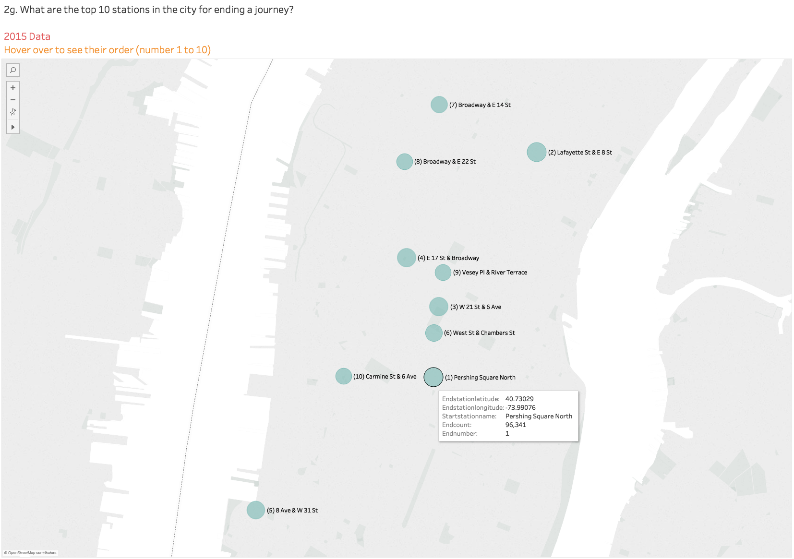
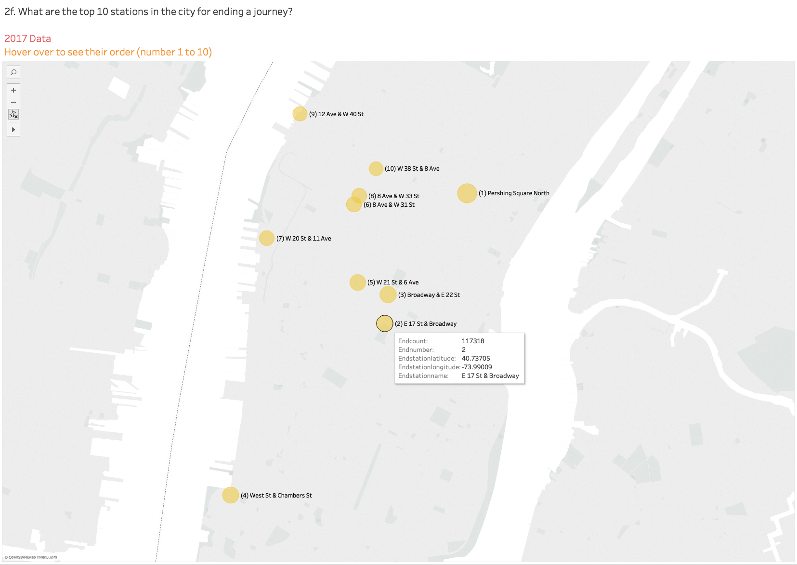

# 1. Clean and manipulate data
## Use 2015-2017 as analysis time period.
- Check column names are consistent through csv files to ensure the concatenate is correct
- Check timestamp is consistent through csv files

# 2. Analysis

## a. How many trips have been recorded total in each month in 2015 to 2017?

- More trips are taken during the warm season than the cold season. 
- The total trip increases with years. 

## b. By what percentage has total ridership grown since 2015?

- The total ridership has increased over 60% in the 2017 compared to the year 2015.

## c. How has the proportion of short-term customers and annual subscribers changed?

- The proportion of annual subscribers increases with years. However, this increase is more in the 2015-2016 than 2016-2017. It seems the growth has slowed down.

## d. What are the peak hours in which bikes are used during summer months?

- During summer months, 8am and 5-6pm are the peak hours. These peak hours represent peak work hour. It might imply during the summer months, most of the bikers are work commuters. 

## e. What are the peak hours in which bikes are used during winter months?

- During winter months, 8am and 5-6pm are still the peak hours -- similar to summer months. 
- However, the total trips in winter months are significantly fewer than the the ones in summer months. It might imply that people commute via bike may encounter difficulties. 

## f. What are the top 10 stations in the city for starting a journey?

- Although the top 10 stations have changed a bit in different years, most of these top stations for starting a journey are inside Manhattan. 
- According to previous findings that most of the bikers are work commuters, we can also find that some popular citi bike station is close to piers. The NY Waterway is the third way for commuters from outside (for example, New Jersey) into Manhattan. 

## g. What are the top 10 stations in the city for ending a journey?

- Similar features as the top 10 stations in starting a journey in the city can be found in the top 10 stations in ending a journey in the city. These features can be connected to the experience of worker/commuters in and around NYC.

## h. What are the bottom 10 stations in the city for starting a journey?

- Most of them are seen outside the Manhattan. This might be related to the local residence type. In other words, not many workers lives there, there is fewer tourist attraction, or commuters prefer other travel method based on local traffic or features.

## i. What are the bottom 10 stations in the city for ending a journey?

- Similar findings as previous ones.

## j. What is the gender breakdown of active participants (Male v.s. Female)?

- Male occupies a large proportion in the active participants. This proportion also increases with years.

## k. How effective has gender outreach been in increasing female/male ridership over the timespan? 

- Although from the previous question, we can find the male participants increase more in numbers, but female participants has a faster growth speed from 2015 to 2017.

## l. How does the average trip duration change by age?

- It's weird to find out > 90 participants are in a large portion. It might imply the poor accurancy in the age data.
- With increasing subsribers, we can see the participants with ages between 10 and 20 occupy the largest proportion in 2017. It might indicate the age data is more accurate in the subscriber data tha in the short-term customer data. 

## m. What is the average distance in miles that a bike is ridden?

- It doesn't show much feature in the figure.

